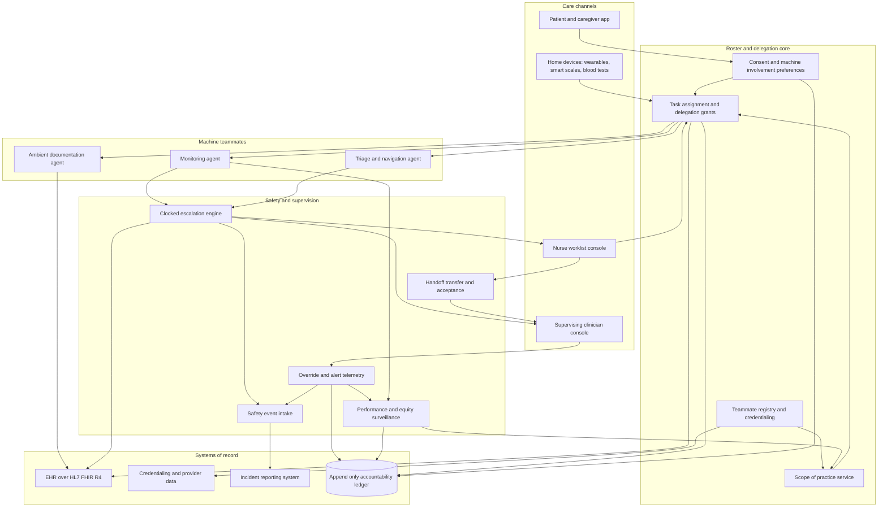

# Scopebound

**Source:** `ai-in-health/Accenture-Health-Meet-Todays-Healthcare-Team-Patients-Doctors-Machines/`
**Domain:** `ai-health`
**One-liner:** A care-team roster and delegation ledger that credentials software agents as scoped teammates — every clinical task assigned to a human or a machine with a named supervising clinician, a recorded patient consent to machine involvement, and a clocked escalation path — so providers can field virtual nurses and AI triage without diffusing clinical accountability.
**Wedge:** Post-discharge and chronic-care monitoring panels at mid-size US health systems and integrated provider groups (300–1,200 beds) running remote patient monitoring for heart failure, COPD and insulin-treated diabetes — the exact workflows where the source finds the strongest consumer appetite (55 percent would use an intelligent virtual nurse that monitors condition, medications and vital signs at home; 62 percent would use virtual care for follow-up care at home after hospitalisation) and where licensed nursing hours are scarcest.
**Positioning:** Clinical workforce management for mixed human-machine care teams. Credentialing and scheduling systems model humans only; AI vendors ship point tools with no concept of who is answerable when the tool acts or fails to act. Scopebound is the roster layer between them: a monitoring agent or triage assistant is registered as a teammate with a versioned scope of practice, a supervision tier, and an expiring delegation grant, so that every machine-performed task is traceable to a licence and a consent.

## Market research synthesis

### Thesis from source

The source is the Accenture 2018 Consumer Survey on Digital Health: a seven-country online survey of 7,905 consumers aged 18 and over — Australia (1,031), England (1,043), Finland (848), Norway (768), Singapore (957), Spain (957) and the United States (2,301) — conducted by Longitude between October 2017 and January 2018. Its headline finding is a supply gap rather than a demand problem. Self-service digital health use is climbing across every channel measured: 75 percent of US consumers say technology is important to managing their health, up from 73 percent in 2016; wearable use has more than tripled from 9 percent in 2014 to 33 percent in 2018; mobile and tablet health app use went from 16 percent to 48 percent over the same period; receipt of virtual healthcare rose from 21 percent in 2017 to 25 percent in 2018, with remote consultation at 16 percent (from 12 percent in 2016) and remote monitoring at 14 percent (from 9 percent). The document states the imbalance plainly: providers are keeping pace on patient portals, but "when it comes to virtual care, robotics and artificial intelligence (AI), consumer interest is surpassing what providers currently offer."

The more consequential finding is *what* consumers are willing to hand over. Nineteen percent have already used health services powered by AI, such as virtual clinicians and home-based diagnostics. Asked what they are likely to use, they rank a home device that tests blood for a variety of indicators at 66 percent, an intelligent virtual health assistant for costs, scheduling, coverage and bills at 61 percent, an intelligent virtual coach at 57 percent, AI genome analysis for genetic risk at 56 percent, an intelligent virtual nurse that monitors condition, medications and vital signs at home at 55 percent, an intelligent virtual clinician that helps diagnose and navigate to treatment options at 50 percent, AI long-term risk prediction at 50 percent, robot-assisted surgery at 38 percent and robotic phlebotomy at 33 percent. Preference for ai-assisted spinal surgery moves from 34 percent to 56 percent once benefits grounded in real clinical data are explained, and 46 percent of 18–44s prefer it before any explanation. Accenture's own read is that robot-assisted surgery is the AI application with the greatest near-term impact, likelihood of adoption and value to the health economy. The paper's closing claim is explicit and organisational: "emerging technologies are shifting the composition of the care team," and "patients, machines and doctors can work together to improve the accessibility, effectiveness and affordability of healthcare."

The objections are equally specific and they are the design constraints. Asked why they would use an AI virtual doctor, consumers cite availability whenever needed (47 percent), time saved by avoiding a trip (36 percent) and the ability to assess vast amounts of relevant information (24 percent). Asked why not, they cite liking to visit the doctor (29 percent), not understanding enough about how AI works (26 percent) and not liking to share their data (23 percent). Data-sharing willingness is not a single switch — it is graded steeply by recipient: 90 percent will share wearable data with their doctor, 88 percent with a nurse or other healthcare professional, 72 percent with their health insurance plan (up from 63 percent in 2016), 47 percent with online communities or other app users (up from 38 percent), 41 percent with a government department or agency and 38 percent with their employer. And in-person care still wins on the attributes that matter clinically: 64 percent think in-person provides better quality care and 45 percent think it diagnoses problems faster, against virtual care's advantages in cost (54 percent), schedule fit (49 percent) and timeliness (43 percent).

Read together, the survey argues for delegation under supervision rather than substitution — and then stops. It never asks the operational questions that "changing the composition of the care team" actually raises: if a virtual nurse holds overnight surveillance for a heart-failure patient, whose licence is that task performed under, what is the agent permitted and forbidden to do, what did the patient actually agree to, what happens when nobody acknowledges the escalation, and what record exists eighteen months later when a claim arrives. Consumers already report that monitoring improves understanding of their condition (75 percent), engagement with their health (73 percent), monitoring a loved one's health (73 percent), overall quality of care (69 percent) and patient-physician communication (69 percent) — these are *team collaboration* outcomes, not device outcomes. The commercially defensible object is therefore not another monitoring dashboard. It is the roster: an accountable record of which teammate, human or machine, holds which task, under whose supervision, within which published scope, on what consent basis.

### Buyer & economic model

- **Primary buyer:** Chief Nursing Officer or Chief Nursing Informatics Officer, co-sponsored by the Chief Medical Officer; in a physician-led integrated group, the VP of Population Health or Ambulatory Operations.
- **Users:** nurse care managers and nurse practitioners running monitoring panels (daily), medical assistants and community health workers (daily), supervising physicians (escalations and periodic sign-off), care-team coordinators and schedulers, patients and family caregivers (consent and interaction), the clinical AI governance committee and informatics team (credentialing, shadow-mode review, scope authoring), risk management and the privacy officer (safety events, access audit).
- **Budget owner / value metric:** the nursing labour and care-management line, supplemented by shared-savings dollars from value-based contracts. The value metric is **supervised panel size per licensed clinician FTE held jointly with escalation-to-recognition time** — capacity gained without safety lost. Secondary metrics are documentation minutes per encounter, avoided 30-day readmissions in monitored cohorts, and nurse retention.
- **Competing status quo:** an RPM vendor dashboard watched by an outsourced monitoring call centre, triage protocols living in a binder or a shared document, delegation recorded informally in EHR free text, agent "credentialing" performed once during procurement by an IT committee and never revisited, and accountability discovered retrospectively in a root-cause analysis after something goes wrong. Ambient scribe products and CDS modules compete for the same budget but answer a narrower question.

### Domain constraints

- **Regulatory / trust / safety:** autonomous triage and acuity prediction can cross from clinical decision support into software as a medical device, which brings a labelled intended use, clinical validation evidence, and post-market surveillance duties that the deploying provider partly inherits. Scope-of-practice and delegation rules are jurisdiction- and licence-specific: what an agent may do under an RN's supervision differs from what it may do under an NP's or a physician's, and differs again across state lines for a telehealth panel. Informed consent for AI involvement in care is becoming an explicit expectation, and the source's 26 percent who "don't understand enough about how AI works" is the consent-comprehension problem stated as a survey figure. Equity of performance across subgroups is a safety property, not a reporting nicety — a deterioration model that under-detects in one population produces systematic, silent harm. Clinician liability requires that overrides are always permitted, cost the clinician nothing to record, and that alert burden is measured rather than assumed tolerable.
- **Data sensitivity:** continuous home vitals and home diagnostic results are PHI under HIPAA and special-category data under GDPR. The source shows consent is graded by recipient (90 percent doctor, 88 percent nurse, 72 percent insurance plan, 47 percent online communities), so "shared with the care team" cannot be modelled as a single permission — a machine teammate is a distinct recipient and needs its own basis. Secondary use of monitoring streams to improve an agent requires a separate, revocable basis from the care basis. Access audit must be able to answer "which teammate, human or machine, read this patient's stream, when, and for which task."
- **Change-management realities:** nurses abandon anything that adds documentation, so machine involvement has to *return* clinician minutes through ambient capture or it will not survive a quarter. Physicians will not supervise what they cannot see, cannot question, or cannot override. A health system cannot validate a broad "AI nurse" in one governance cycle, so agents must be introducible one task class at a time with a shadow period against the organisation's own population before live delegation. And the 29 percent who prefer seeing a doctor must keep a genuine, non-punitive opt-out — the machine-free path has to remain equally staffed, or consent is nominal.

## Business requirements

- BR-1: Every task in a patient's plan of care must have exactly one accountable performer — human or machine — and one named supervising clinician holding the licence under which the task is performed; no task may run unassigned or unsupervised.
- BR-2: A machine teammate may perform only the task classes explicitly inside its currently published scope of practice; an attempt outside that scope must be refused and recorded as a scope violation rather than silently downgraded or completed anyway.
- BR-3: Patients must be able to consent to, restrict, or decline machine involvement per task class and per data recipient, and a decline must route the task to a human performer with no loss of access or care quality, so that the 29 percent who prefer a human remain fully served.
- BR-4: No agent may receive live delegation until it has passed a documented credentialing review covering intended use, validation evidence, known failure modes, subgroup performance, and a shadow-mode period run against the deploying organisation's own population.
- BR-5: Deterioration signals must escalate on a defined clock to a named human at each tier, and an unacknowledged escalation must automatically promote to the next tier rather than expire, close, or queue silently.
- BR-6: Every handoff between teammates — shift to shift, human to machine, machine to human — must transfer a structured summary of open problems, pending results and unresolved risks, and accountability must not transfer until the receiving teammate explicitly accepts.
- BR-7: Clinician overrides of machine recommendations must be recordable in a single step with a reason code, must never be blocked or require justification to a supervisor, and override and acceptance rates must be reported per agent and per task class as primary safety indicators.
- BR-8: Machine involvement must reduce clinician documentation minutes per encounter against a pre-deployment baseline, and the platform must measure and publish that comparison rather than assert it.
- BR-9: Agent performance must be monitored continuously against its credentialed claim and broken out by age band, sex, race and ethnicity, primary language and payer class, with automatic suspension of the affected scope when a subgroup floor is breached.
- BR-10: Any patient harm or near-miss involving a machine teammate must generate a safety event inside the organisation's reporting window, linked to the specific task, agent version, supervising clinician and the consent state in force at the moment of the event.
- BR-11: For any past task, the organisation must be able to reconstruct who or what performed it, under whose supervision, on which agent version and scope document, with what patient consent and what data access — as a single exportable record fit for a malpractice defence, a regulator, or a post-market surveillance submission.
- BR-12: Supervised panel size per licensed clinician FTE must rise without an increase in escalation-to-recognition time, and the platform must report the two together so that capacity gains cannot be booked while safety quietly degrades.

## User stories

Canonical user stories live in sibling [USER_STORIES.md](USER_STORIES.md).

## System design

### Overview

Scopebound runs alongside the EHR as the roster and delegation layer for a care team that now contains software. Humans and agents are registered as teammates; each agent carries an intended use, a validation dossier and a versioned scope of practice authored by the deploying organisation rather than the vendor. Plan-of-care tasks are then assigned to performers through expiring delegation grants, each naming a supervising clinician and each evaluated against the patient's machine-involvement consent at the moment of execution — not at enrolment. While tasks run, the system holds the safety scaffolding that ad-hoc AI deployments lack: clocked escalation tiers that promote rather than expire, structured handoffs that require explicit acceptance before accountability moves, one-click override capture, and continuous subgroup performance surveillance that can suspend a scope without a committee meeting. Everything an agent does, and every consent and access decision behind it, lands in an append-only accountability ledger from which a single task can be reconstructed years later.

### Actors & boundaries

- **Actors:** patient and family caregiver; nurse care manager and nurse practitioner; supervising physician; medical assistant and community health worker; machine teammate (monitoring agent, triage and navigation agent, ambient documentation agent); agent vendor; clinical AI governance committee; risk, compliance and privacy officers; the EHR as legal record.
- **Trust boundary:** Scopebound is deliberately not the clinical source of truth. The EHR remains the legal record and receives structured writebacks for tasks, escalations and notes; Scopebound owns the *authority* layer. An agent may execute inside the vendor's environment or the system's own, but it can only act under a delegation grant issued here, so the grant — not the integration — is what gates machine authority. Patient identifiers crossing to an agent are scoped to the granted task class, and consent is re-evaluated per execution. The accountability ledger is append-only with scope documents and agent versions pinned by content hash, so a scope cannot be rewritten after the fact.
- **Human-in-the-loop points:** credentialing approval before any live scope; supervising clinician sign-off on each delegation grant; escalation acknowledgement at every tier; override of any machine recommendation; scope suspension review and reinstatement; consent change and withdrawal; safety event review and closure.

### Core capabilities

1. **Teammate registry and credentialing** — one roster for human licences and machine agents, each agent holding an intended use, validation dossier, known failure modes and shadow-mode results.
2. **Scope of practice authoring and enforcement** — versioned, organisation-owned documents binding task classes to supervision tiers and jurisdictional delegation rules, enforced at execution.
3. **Care task assignment and delegation grants** — expiring grants naming performer, supervisor and consent basis, revocable instantly by the assigning clinician.
4. **Patient consent and machine-involvement preferences** — per-task-class and per-recipient consent with guaranteed human fallback routing.
5. **Clocked escalation** — tiered thresholds, acknowledgement deadlines, automatic promotion, and delivery of triggering evidence with the alert.
6. **Handoff safety** — structured transfer of open problems and pending results with explicit acceptance before accountability moves.
7. **Override and alert telemetry** — one-step override capture with reason codes, plus acceptance rates and alert burden per clinician and per agent.
8. **Ambient documentation capture** — encounter capture drafted into the task record and attested by the clinician, with audio destroyed after drafting.
9. **Performance and equity surveillance** — continuous accuracy monitoring against the credentialed claim, broken out by subgroup, with automatic scope suspension on breach.
10. **Safety events and adverse event routing** — near-miss and harm records bound to task, agent version, supervisor and consent state, filed into the incident system.
11. **Accountability reconstruction and audit export** — per-task forensic record and per-patient access trail.
12. **Panel capacity analytics** — supervised panel per FTE reported jointly with escalation-to-recognition time and documentation minutes.

### Conceptual data

- **Primary entities:** Patient, CareTeam, Teammate, MachineAgentProfile, ValidationDossier, ScopeOfPractice, TaskClass, CareTask, DelegationGrant, ConsentRecord, EscalationEvent, Handoff, OverrideEvent, SubgroupPerformanceMetric, ScopeSuspension, SafetyEvent, AccessAuditEntry, PanelCapacitySnapshot, AccountabilityRecord.
- **Critical events:** agent credentialed and admitted to the roster; scope published, revised, suspended or revoked; delegation granted, expired, or revoked mid-task; task performed by a machine; scope violation refused; consent granted, restricted or withdrawn; escalation raised, acknowledged, or auto-promoted; handoff offered and accepted or lapsed; recommendation overridden; subgroup floor breached; safety event opened and closed; patient record accessed by a teammate.
- **Retention / audit needs:** task-level accountability records must outlive the clinical record's active life — retained for the jurisdiction's malpractice statute of limitations plus the paediatric tail — with the scope document and agent version pinned by hash so neither can be retroactively edited. Consent state is snapshotted at each execution rather than referenced by pointer. Access audit is retained for at least the HIPAA six-year window and satisfies GDPR accountability. Validation dossiers and subgroup metrics are retained for the agent's full deployed life to support post-market surveillance. Ambient audio is retained only until the draft is produced and then destroyed; the draft and the clinician's attestation are retained.

### Integrations (conceptual)

- **Systems of record:** the EHR over HL7 FHIR R4 (Patient, CareTeam, CarePlan, Task, Encounter, Observation, Practitioner, PractitionerRole, Consent, Communication, DetectedIssue, DocumentReference), the credentialing and provider data management system, nurse scheduling and workforce management, the patient portal, the incident and safety reporting system, and the enterprise identity provider.
- **Upstream signals:** remote patient monitoring devices, wearables, smart scales and home diagnostic kits of the kind the source tracks; portal consent and communication preferences; ADT feeds for admission and discharge; lab and imaging results; agent vendor model cards, release notes and recall notices; jurisdictional scope-of-practice and telehealth rule sets.
- **Downstream actions:** delegation grants issued to agents; tasks, escalations and notes written back to the EHR as FHIR Task, Communication and DetectedIssue resources; pages and secure messages to the supervising clinician; nurse worklist updates; schedule holds for human-fallback visits when a patient declines machine involvement; safety event filings; scope suspension notices to vendor and governance committee; audit exports for legal and regulatory requests.

### High-level architecture

Two paths meet in the roster. The care path is where patients, devices and clinicians generate work and where agents execute it, and it must stay fast and unobtrusive. The authority path — credentialing, scopes, consent, surveillance and the accountability ledger — is durable and evidentiary, and it is what makes the care path defensible. Keeping them distinct is what lets a monitoring agent act within seconds while still leaving a record that stands up years later.

### Success metrics

- **Leading:** share of monitoring tasks executing under an explicit delegation grant rather than informal arrangement; percentage of live agents holding a current scope plus in-population shadow validation; median escalation acknowledgement time by tier and share auto-promoted for non-acknowledgement; override and acceptance rates per agent and task class; documentation minutes per encounter against the pre-deployment baseline; share of monitored patients with an explicit machine-involvement preference recorded; handoff acceptance rate and count of tasks that lapsed between shifts; subgroup floor breaches caught by surveillance before any safety event.
- **Lagging:** supervised panel size per licensed clinician FTE; escalation-to-clinical-recognition interval for deteriorating patients; 30-day readmission rate in monitored cohorts; nurse turnover and self-reported documentation burden; consent withdrawal rate and share of withdrawals served by a human within one day; safety events per thousand machine-performed tasks and their severity mix; proportion of malpractice or regulatory requests where the accountability record was complete and sufficient on first production.

## OpenAPI skeleton

Canonical HTTP surface lives in sibling [openapi.yaml](openapi.yaml). Summary:

- **Base path:** `/v1/...`
- **Auth:** `X-API-Key` for agent and device integrations acting under a delegation grant; Bearer JWT for clinician, patient and governance consoles.
- **Resource groups:** Teammates, Scopes, Tasks, Consent, Escalations, Handoffs, Surveillance, Safety, Audit.
