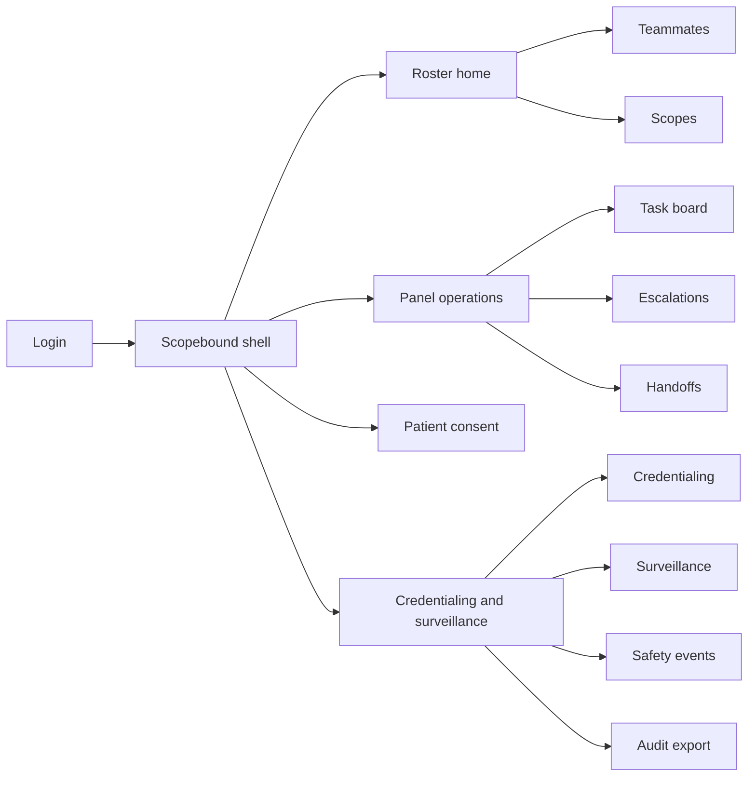
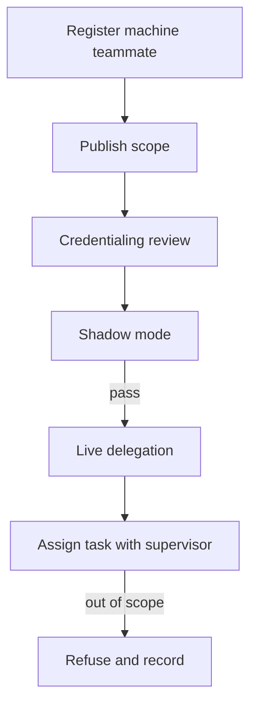

# Scopebound — Web app

**Product:** [PRODUCT.md](./PRODUCT.md)
**Primary surface:** Mixed human–machine care-team roster console (RPM / post-discharge ops)
**Secondary surfaces:** Patient consent-to-machine involvement portal; malpractice/audit reconstruction export
**Design thesis:** Scopebound is a credentialed roster for software agents as scoped teammates — not a vitals dashboard and not an ambient documentation disposition desk. The metaphor is a nursing assignment board extended to machines: every monitoring or triage task has exactly one accountable performer and one supervising licence, inside a published scope, on a recorded patient consent, with escalations that promote themselves when ignored. Visual language is assignment-board indigo and escalation-signal amber on cool ward grey — scope violations feel like hard refusals; human-preferring patients feel fully served. The Scopebound wordmark anchors every panel so capacity claims never outrun escalation-to-recognition time.

## UX research synthesis

### Category peers (best-in-class)

- **TigerConnect / Vocera Care Team:** Named role assignment and escalation trees for clinical teams. Steal: explicit performer + supervisor on every task; reject chat-only accountability without scope documents.
- **Current Health / Biofourmis RPM consoles:** Home monitoring panels with alert tiers. Steal: deterioration clocks and tier promotion; reject device telemetry as the primary object instead of the rostered task.
- **CredentialStream / Modio (provider credentialing):** Documented review before privileging. Steal: agents cannot go live without credentialing + shadow mode; reject treating vendor go-live as privileging.
- **Epic Care Companion / MyChart care-team views (patient-facing):** Clear who is on the team. Steal: patient-visible machine involvement with decline-to-human parity; reject dark-pattern consent to hit automation targets.

### Patterns to adopt / reject

- **Adopt:** One performer + one supervisor per task; published machine scope; consent per task class/recipient; clocked multi-tier escalation that auto-promotes; structured handoff acceptance; override in one step; subgroup suspension of scope; reconstructable audit pack.
- **Reject:** Unowned bot alerts; silent scope downgrade; documentation-savings assertions without baseline; dashboard-of-vitals as home; purple “AI nurse” mascots.

### Trust, density, and workflow constraints from PRODUCT.md

No unsupervised tasks (BR-1). Out-of-scope attempts refuse and record (BR-2). Decline machine → human without quality loss (BR-3). Credentialing + shadow before live delegation (BR-4). Escalations never expire silently (BR-5). Handoffs require accept (BR-6). Overrides never blocked (BR-7). Doc minutes measured vs baseline (BR-8). Subgroup floors suspend scope (BR-9). Harm links agent version + consent (BR-10). Reconstruction for defence/regulator (BR-11). Panel size gains reported with escalation latency (BR-12).

## Information architecture

### Nav model

### Roles → default home

| Role | Default home | Why |
|------|--------------|-----|
| Supervising clinician | Panel task board + escalations | Licence accountability (BR-1, BR-5) |
| RPM nurse / care manager | Task board | Human performer and overrides (BR-7) |
| Virtual nursing ops lead | Roster home | Agent scopes and panel size (BR-12) |
| Credentialing / informatics | Credentialing queue | Shadow before live (BR-4) |
| Patient / caregiver | Consent portal | Decline without penalty (BR-3) |
| Patient safety / compliance | Safety + audit | BR-10, BR-11 |

### Cross-links to OpenAPI resources

| Nav area | OpenAPI tags / resources |
|----------|---------------------------|
| Human and machine teammates, roster status | Teammates |
| Scope of practice documents, jurisdiction | Scopes |
| Plan tasks, performers, supervisors | Tasks |
| Patient consent per task class/recipient | Consent |
| Tiered escalation clocks | Escalations |
| Structured handoffs | Handoffs |
| Performance and subgroup floors | Surveillance |
| Harm/near-miss linkage | Safety |
| Reconstructable task record | Audit |

## Screen inventory

### Roster home

- **Purpose:** Answer “which agents are live, shadowed, or suspended — and is panel growth costing escalation time?”
- **Entry:** Ops lead default.
- **Layout regions:** Brand; teammate roster; live vs shadow vs suspended; panel size vs escalation-to-recognition sparkline.
- **Primary actions:** Open teammate; open credentialing; open latency report.
- **Empty / loading / error:** No agents = human-only roster still valid.
- **BR / story ties:** BR-4, BR-12.

### Teammate dossier

- **Purpose:** Register machine or human teammate with supervision tier and roster status.
- **Entry:** Roster → teammate.
- **Layout regions:** Kind (human/machine); version; supervision tier; assigned panels; linked scope docs; failure modes summary.
- **Primary actions:** Update roster status; attach scope; start shadow; suspend.
- **Empty / loading / error:** Machine without scope cannot receive tasks.
- **BR / story ties:** BR-1, BR-2, BR-4.

### Scope of practice editor

- **Purpose:** Publish allowed/forbidden task classes for an agent version.
- **Entry:** Scopes nav; dossier.
- **Layout regions:** Allowed task classes; exclusions; jurisdiction; version history; violation log.
- **Primary actions:** Publish scope; refuse-test simulator; retire version.
- **Empty / loading / error:** Draft scope cannot authorise live tasks.
- **BR / story ties:** BR-2.

### Credentialing and shadow

- **Purpose:** Documented review before live delegation: intended use, validation, failure modes, subgroups, shadow period.
- **Entry:** Govern → Credentialing.
- **Layout regions:** Checklist evidence; shadow metrics vs claim; go-live decision; subgroup floors.
- **Primary actions:** Approve live; extend shadow; deny.
- **Empty / loading / error:** Incomplete checklist blocks live.
- **BR / story ties:** BR-4, BR-9.

### Panel task board

- **Purpose:** Every care-plan task with exactly one performer and one supervisor.
- **Entry:** Clinician/nurse default.
- **Layout regions:** Patient panel columns or list; performer badge (human/machine); supervisor; consent state; due clocks.
- **Primary actions:** Assign/reassign within scope; override machine; open escalation.
- **Empty / loading / error:** Unassigned task = blocking integrity fault.
- **BR / story ties:** BR-1, BR-3, BR-7.

### Escalation rail

- **Purpose:** Deterioration signals escalate on clocks; unacked auto-promotes.
- **Entry:** Panel ops; alerts.
- **Layout regions:** Tier queue; countdown; named human per tier; promote history; never-silent-expire banner.
- **Primary actions:** Acknowledge; promote; document action.
- **Empty / loading / error:** Empty with last signal time; clock fault = safety incident.
- **BR / story ties:** BR-5, BR-12.

### Handoff acceptance

- **Purpose:** Structured summary transfer; accountability moves only on explicit accept.
- **Entry:** Shift change; human↔machine transitions.
- **Layout regions:** Open problems; pending results; unresolved risks; accept/refuse.
- **Primary actions:** Accept handoff; refuse with reason; keep prior accountability.
- **Empty / loading / error:** Pending unaccepted = prior owner retained.
- **BR / story ties:** BR-6.

### Patient consent portal

- **Purpose:** Consent/restrict/decline machine involvement per task class and data recipient.
- **Entry:** Patient link; enrolment.
- **Layout regions:** Plain-language task classes; recipient list; decline → guaranteed human path; revoke.
- **Primary actions:** Consent; decline; restrict recipients.
- **Empty / loading / error:** Decline confirmed with “no loss of access” copy.
- **BR / story ties:** BR-3.
- **Mobile notes:** Large controls; caregiver proxy mode labelled.

### Surveillance and subgroup floors

- **Purpose:** Continuous agent performance vs credentialed claim; auto-suspend scope on subgroup breach.
- **Entry:** Govern → Surveillance.
- **Layout regions:** Metrics by demographics; floor markers; suspended scopes; doc-minutes vs baseline.
- **Primary actions:** Suspend scope; open mitigation; publish doc-minute comparison.
- **Empty / loading / error:** Small cells suppressed.
- **BR / story ties:** BR-8, BR-9.

### Safety event linkage

- **Purpose:** Harm/near-miss tied to task, agent version, supervisor, consent state.
- **Entry:** Safety nav; from task.
- **Layout regions:** Event form; auto-linked context; reporting window countdown.
- **Primary actions:** File event; export pack.
- **Empty / loading / error:** Missing link fields block close.
- **BR / story ties:** BR-10.

### Audit reconstruction

- **Purpose:** Single exportable record of who/what performed a past task under which supervision/scope/consent.
- **Entry:** Compliance; legal request.
- **Layout regions:** As-of picker; timeline; export package.
- **Primary actions:** Generate defence/regulator pack.
- **Empty / loading / error:** Partial reconstruction flagged.
- **BR / story ties:** BR-11.

## Key flows

1. **Credential machine → live task** — register teammate → publish scope → credentialing + shadow → live delegation → assign tasks under supervisor; failure: scope violation refuses and logs.

2. **Patient declines machine** — decline task class → reroute human performer → no access/quality penalty.

3. **Escalation auto-promote** — signal → tier-1 clock → unacked → tier-2 → … → never silent close.

4. **Handoff** — structured summary → receiver accept → accountability transfers; refuse keeps prior owner.

5. **Subgroup suspend** — floor breach → suspend affected scope → tasks refuse machine path → human coverage.

## Design system

### Tokens (CSS variables)

- `--color-ink: #1A1F2A` — primary text
- `--color-ward: #E8EBF0` — app ground
- `--color-panel: #F7F8FA`
- `--color-indigo: #3A4F8A` — roster chrome / brand accent
- `--color-scope: #1F7A62` — in-scope / accepted handoff
- `--color-escalate: #C47A10` — escalation clock
- `--color-violate: #B03A34` — scope violation / suspend
- `--color-brand: #2C3A5C` — Scopebound wordmark
- `--font-display: "Sora", sans-serif` — roster titles and panel KPIs (expressive, not Inter)
- `--font-body: "IBM Plex Sans", sans-serif`
- `--font-mono: "IBM Plex Mono", monospace` — agent versions, task ids
- `--space-1`…`--space-8`: 4px scale
- `--radius-sm: 4px`; `--radius-md: 8px`
- `--motion-promote: 180ms ease-out` — escalation tier promote
- `--motion-refuse: 150ms ease-out` — scope violation
- `--motion-handoff: 220ms ease-in-out` — accept stamp
- Atmosphere: subtle assignment-grid; no consumer wellness stock photos.

### Typography & brand

- Display for roster and escalation numerals; body for boards; mono for versions.
- Brand on roster home and audit exports.
- Patient portal: brand-first; one headline about choosing human or machine help; one CTA — no engagement scoreboards.

### Do / don’t

- **Do:** Show supervisor on every task; auto-promote escalations; honour declines; measure doc minutes vs baseline; report panel size with latency.
- **Don’t:** Unowned bots; silent expire; block overrides; purple AI nurse illustrations; vitals-only home.

### Accessibility & domain trust cues

- AA+; escalation not colour-only.
- Live regions for tier promotions.
- Patient consent plain language and language-access fields.
- Focus order: acknowledge escalation before other panel chrome.

## Component patterns

- **TeammateRosterCard** — human/machine, status, supervision tier (interaction container).
- **ScopeViolationToast** — refuse with recorded reason.
- **TaskAccountabilityRow** — performer + supervisor + consent chip.
- **EscalationTierClock** — countdown with auto-promote.
- **HandoffAcceptPanel** — structured summary + accept.
- **MachineConsentSheet** — per task class / recipient.
- **SubgroupFloorMeter** — performance vs suspend threshold.
- **AuditReconstructionPack** — single exportable defence record.

## Out of scope for v1 web

- Building the virtual nurse model itself; device firmware; full EHR charting; consumer wellness social feeds; payroll; multi-tenant marketplace of third-party agents without credentialing.
